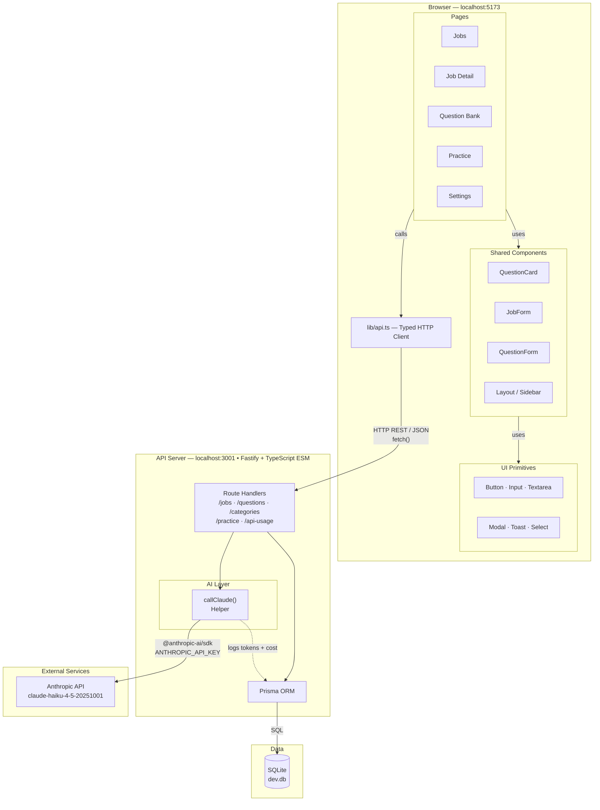
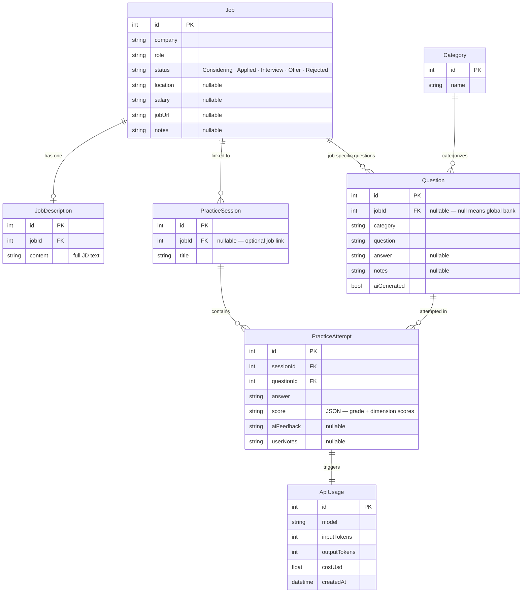

# Architecture

## System Overview

Personal interview prep and job tracking tool. Single-user, local-first, no auth. Runs entirely on localhost — API on port 3001, web on port 5173. The only external dependency is the Anthropic API for AI-powered question generation and answer scoring.

---

## System Architecture Diagram



---

## Data Model Diagram



---

## Module Map

### `api/`
Fastify REST API. Owns all business logic, database access, and AI calls.

| File | Purpose |
|------|---------|
| `src/index.ts` | Single entry point — all routes, middleware, and the `callClaude()` helper |
| `prisma/schema.prisma` | Source of truth for the data model |
| `prisma/migrations/` | Applied migration history |
| `.env` | `ANTHROPIC_API_KEY` (never committed) |

- Depends on: Prisma (DB), `@anthropic-ai/sdk` (AI)
- Nothing depends on the API internals — frontend talks to it over HTTP only

### `web/`
React SPA. Owns all UI, routing, and client-side state.

| File | Purpose |
|------|---------|
| `src/lib/api.ts` | Typed HTTP client — all API calls go through here |
| `src/lib/utils.ts` | Shared helpers: `cn()`, `safeJsonParse()`, `formatCost()`, color maps |
| `src/pages/` | Route-level components (one file per page) |
| `src/components/` | Shared components (`QuestionCard`, `JobForm`, etc.) |
| `src/components/ui/` | UI primitives (`Button`, `Input`, `Modal`, `Toast`, etc.) |

- Depends on: `api/` over HTTP only
- No server-side rendering

---

## Data Model Decisions

**Why SQLite?** Local-first, single-user tool. No infra cost, no network latency, no auth required. Prisma makes migration to Postgres trivial if that ever changes.

**Key schema choices:**

| Choice | Rationale |
|--------|-----------|
| `Question.jobId` nullable | Supports global question bank (null) and job-specific questions — same table, filter by jobId |
| `Question.aiGenerated` flag | Distinguishes AI-created questions from user-authored ones for UI display |
| `PracticeAttempt.score` as JSON string | AI scoring dimensions are flexible; storing as JSON avoids schema migrations when dimensions change. Parsed client-side with `safeJsonParse()`. |
| `ApiUsage` table | Every Claude API call logs input tokens, output tokens, and cost. Enables cost visibility in UI without external tooling. |
| Categories in DB | User-extensible via Settings page. Not hardcoded — allows custom categories without code changes. |

---

## API Design Rationale

**All routes in one file (`src/index.ts`)** — MVP decision. Keeps it fast to navigate for a small surface area. Split into modules when file exceeds ~600 lines or when a second dev joins.

**`callClaude()` helper centralizes all AI calls:**
- Single place to swap models (currently `claude-haiku-4-5-20251001`)
- Automatically logs every call to `ApiUsage` table
- Consistent error surfacing

**Error handling:** Fastify's built-in error handler catches unhandled throws. Route handlers explicitly return 4xx for validation errors, 500 for unexpected failures.

**No auth:** Solo use. If this ever becomes multi-user, add JWT middleware at the Fastify level and row-level user filtering in Prisma queries.

---

## Frontend Architecture

**State management:** `useState` + `useEffect` per page — no global store. Each page fetches its own data on mount and reloads after mutations. Simple, no abstraction overhead for a single-user tool.

**Error handling:** `ToastProvider` wraps the app root. Every API call is wrapped in `try/catch` that calls `toast.error()`. Errors surface to the user without crashes.

**Component hierarchy:**
```
App (router + ToastProvider)
└── Layout (sidebar + nav)
    └── Pages (route-level, own their data fetching)
        ├── Shared components (QuestionCard, JobForm, QuestionForm)
        └── ui/ primitives (Button, Input, Modal, etc.)
```

**API client (`lib/api.ts`):** Typed wrapper around `fetch`. All endpoints defined here with full TypeScript interfaces. Pages import from `@/lib/api` — never call `fetch` directly.

**`safeJsonParse<T>()`:** Used wherever AI-generated JSON is parsed (practice attempt scores). Prevents render crashes on malformed data from the AI.

---

## Key Architectural Decisions

**Decision**: Copy question from bank = duplicate record (not a reference/link)
**Why**: Simpler mutation model. Job-specific questions can be edited freely without affecting the bank original.
**Alternatives rejected**: Shared reference with override fields — too complex for current scale.

---

**Decision**: ESM (`"type": "module"`) for the API
**Why**: Top-level `await` required for Prisma client initialization. CJS mode in `tsx` doesn't support it.
**Alternatives rejected**: Wrapping in async IIFE — works but uglier, non-standard.

---

**Decision**: TailwindCSS v4 via CSS `@import` (no `tailwind.config.js`)
**Why**: v4 config-file-less by default. Simpler setup, no JS config to maintain.
**Alternatives rejected**: v3 with config file — would require downgrade.

---

**Decision**: All AI calls backend-only
**Why**: API key must never reach the browser. Centralizing in the API also enables cost logging and model swapping without frontend changes.
**Alternatives rejected**: Frontend SDK calls — would expose the API key in the browser.

---

**Decision**: Practice sessions as a grouping concept with optional job link
**Why**: Supports both job-specific prep (linked session) and general practice (freeform session). Flexible without requiring a job to exist first.
**Alternatives rejected**: Sessions always requiring a job — too rigid for freeform practice.

---

## Revision History

| Date | Change |
|------|--------|
| 2026-02-23 | Initial architecture document created — covers v1 full implementation |
| 2026-02-23 | Added Mermaid system architecture diagram and ER data model diagram |
